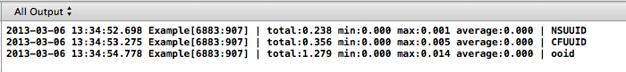

RRBenchmark
=============

```objc
    [RRBenchmark benchmark:^(RRBRunner* runner){

      [runner report:@"NSUUID:UUIDString" context:^{
        // Code block 1
        NSString* uid = [[NSUUID UUID] UUIDString];
      }];

      [runner report:@"CFUUIDCreate" context:^{
        // Code block 2
        CFUUIDRef uuid = CFUUIDCreate(nil);
        NSString* uid =  (__bridge NSString*)CFUUIDCreateString(nil, uuid);
        CFRelease(uuid);
      }];

      [runner report:@"ooid" context:^{
        // Code block 3
        // http://sourceforge.net/projects/ooid/
        NSString* uid = [UUID generateV4];
      }];

    } iterations:10000];
```



Install
=============

- [CocoaPods: The Objective-C Library Manager](http://cocoapods.org/ "CocoaPods: The Objective-C Library Manager")

```bash
    # My Beta podspec Repository
    pod repo add laiso https://github.com/laiso/Specs.git beta
    # Add Podfile
    # pod 'RRBenchmark'
    
    pod install
```

Acknowledgements
=============

- [keithpitt/DKBenchmark](https://github.com/keithpitt/DKBenchmark "keithpitt/DKBenchmark · GitHub")
- [soffes/json-benchmarks](https://github.com/soffes/json-benchmarks "soffes/json-benchmarks · GitHub")
